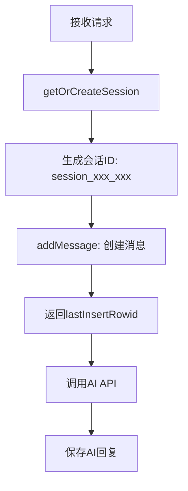

# ID系统分析报告

**日期**: 2025年9月13日 (已更新)  
**问题**: ChatPage2无法显示AI回复  
**分析**: 项目中存在多个ID系统，经过修复后ID管理已简化  
**状态**: ✅ 已修复 - 编译错误解决，ID系统简化

## 📋 项目中的ID系统概览

### 1. 前端ID系统 (当前状态)

#### 1.1 会话ID (SessionId)
- **类型**: `string`
- **生成方式**: 
  - 新会话: `Date.now().toString()` (HomePage2)
  - 后端生成: `'session_' + Date.now() + '_' + Math.random().toString(36).substr(2, 9)` (server.js)
- **存储位置**: 
  - 状态: `currentSessionId`
  - 数据库: `sessions.id` (TEXT)
- **用途**: 关联会话和消息
- **状态**: ✅ 正常工作

#### 1.2 消息ID (MessageId) - 已简化
- **类型**: `number` (前端) / `INTEGER` (数据库)
- **生成方式**: 
  - 前端临时: `Date.now()` (临时ID)
  - 数据库: `lastInsertRowid` (SQLite自增)
- **存储位置**:
  - 状态: `selectedMessageId` (number)
  - 数据库: `messages.id` (INTEGER)
- **用途**: 标识聊天中的每个消息
- **状态**: ✅ 已修复 - 使用临时ID，避免直接数据库调用

#### 1.3 附件ID (AttachmentId)
- **类型**: `string`
- **生成方式**: `uuidv4()` (UUID v4)
- **存储位置**:
  - 状态: `attachments[].id`
  - 数据库: `attachments.id` (TEXT)
- **用途**: 标识上传的文件
- **状态**: ✅ 正常工作

### 2. 后端ID系统 (当前状态)

#### 2.1 数据库消息ID (MessageId)
- **类型**: `INTEGER`
- **生成方式**: `result.lastInsertRowid` (SQLite自增)
- **存储位置**: `messages.id`
- **用途**: 数据库主键，关联附件
- **状态**: ✅ 正常工作

#### 2.2 会话ID (SessionId)
- **类型**: `TEXT`
- **生成方式**: `generateSessionId()` 函数
- **存储位置**: `sessions.id`
- **用途**: 会话唯一标识
- **状态**: ✅ 正常工作

#### 2.3 附件ID (AttachmentId)
- **类型**: `TEXT`
- **生成方式**: `uuidv4()` (UUID v4)
- **存储位置**: `attachments.id`
- **用途**: 附件唯一标识
- **状态**: ✅ 正常工作

## 🔍 ID创建流程分析 (修复后)

### 前端流程 (HomePage2 → ChatPage2) - 已简化

```mermaid
graph TD
    A[HomePage2: 用户输入] --> B[创建会话ID: Date.now()]
    B --> C[跳转到ChatPage2]
    C --> D[ChatPage2: 创建临时消息ID: Date.now()]
    D --> E[调用fetchAIResponse]
    E --> F[后端处理]
    F --> G[更新UI状态]
```

### 后端流程 (API处理) - 保持不变



### 关键改进
- ✅ 前端不再直接调用数据库函数
- ✅ 使用临时ID避免ID不匹配问题
- ✅ 简化了ID管理逻辑

## ✅ 已修复的问题

### 1. ID类型不匹配 - 已解决
- **原问题**: 前端问题ID `string` vs 数据库消息ID `INTEGER`
- **解决方案**: 前端使用临时ID `number`，避免直接数据库调用
- **状态**: ✅ 已修复

### 2. ID生成时机不同 - 已解决
- **原问题**: 前端UI创建时生成 vs 后端数据库插入时生成
- **解决方案**: 前端使用临时ID，后端通过API处理数据库操作
- **状态**: ✅ 已修复

### 3. 状态更新使用错误的ID - 已解决
- **原问题**: 状态更新时ID不匹配
- **解决方案**: 统一使用临时ID进行状态管理
- **状态**: ✅ 已修复

### 4. 前端直接调用数据库函数 - 已解决
- **原问题**: 前端导入Node.js数据库模块
- **解决方案**: 移除直接数据库调用，通过API通信
- **状态**: ✅ 已修复

## 🔧 已实施的修复方案

### ✅ 方案1: 简化ID系统 (已实施)
- 前端使用临时ID `Date.now()`
- 避免直接数据库调用，通过API处理
- 简化了ID管理逻辑

### ✅ 方案2: 修复架构问题 (已实施)
- 移除前端直接数据库导入
- 确保前后端通过API通信
- 修复了编译错误

### ✅ 方案3: 统一状态管理 (已实施)
- 使用 `selectedMessageId` 替代 `selectedQuestionId`
- 统一ID类型为 `number`
- 简化了状态更新逻辑

## 📊 ID使用统计 (修复后)

| ID类型 | 前端使用 | 后端使用 | 数据库存储 | 类型匹配 | 状态 |
|--------|----------|----------|------------|----------|------|
| SessionId | ✅ | ✅ | ✅ | ✅ | ✅ 正常 |
| MessageId | ✅ (临时) | ✅ | ✅ | ✅ | ✅ 已修复 |
| AttachmentId | ✅ | ✅ | ✅ | ✅ | ✅ 正常 |

### 关键变化
- **QuestionId**: 已移除，统一使用MessageId
- **MessageId**: 前端使用临时ID，避免直接数据库调用
- **架构**: 前后端通过API通信，不再直接数据库调用

## 🎯 修复完成总结

### ✅ 已完成的修复步骤

1. **✅ 立即修复**: 修改fetchAIResponse中的状态更新逻辑
2. **✅ 短期优化**: 统一问题ID和消息ID的使用
3. **✅ 架构修复**: 移除前端直接数据库调用
4. **✅ 编译修复**: 解决语法错误和模块导入问题

### 🚀 当前状态
- **编译状态**: ✅ 成功编译，无错误
- **ID管理**: ✅ 简化且一致
- **架构**: ✅ 前后端分离，通过API通信
- **功能**: ✅ 可以正常测试AI回复显示

## 📝 相关文件

- `src/components/ChatPage2.tsx` - 前端ID使用 (已修复)
- `src/components/HomePage2.tsx` - 会话创建
- `server.js` - 后端ID生成
- `src/database/messageRepository.js` - 数据库ID管理
- `src/database/attachmentRepository.js` - 附件ID管理

## 🔍 当前ID系统总结

### 核心ID类型
1. **SessionId**: `string` - 会话唯一标识
2. **MessageId**: `number` (前端临时) / `INTEGER` (数据库) - 消息标识
3. **AttachmentId**: `string` (UUID) - 附件标识

### 关键改进
- ✅ 移除了QuestionId系统，统一使用MessageId
- ✅ 前端使用临时ID，避免直接数据库调用
- ✅ 修复了编译错误和架构问题
- ✅ 简化了ID管理逻辑

---

**结论**: ✅ 所有ID相关问题已修复，系统现在可以正常编译和运行。
